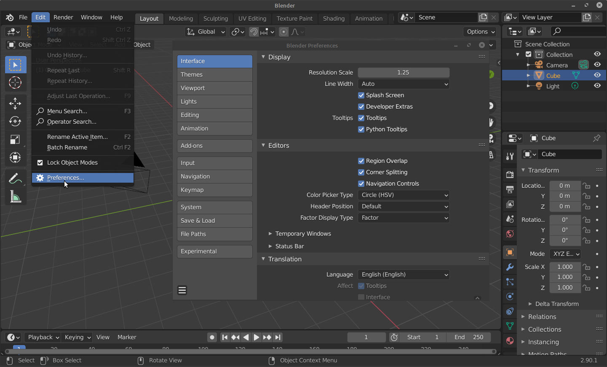
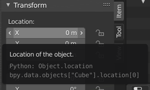
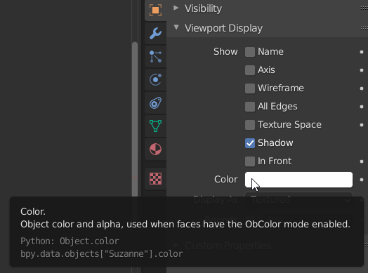
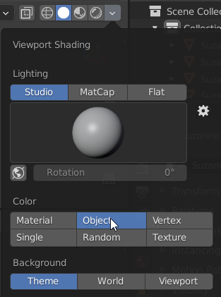
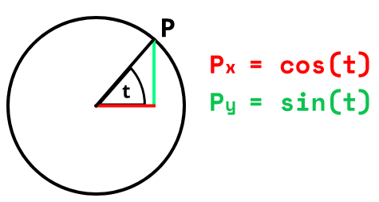

 
**In dieser Übung wollen wir uns mit dem Setup von Blender für Scripting, sowie den Tools, die uns von Blender selbst dafür zur Verfügung gestellt werden beschäftigen.**

## Einführung

Wie viele andere Softwarepakete im Bereich der Medienproduktion lässt sich Blender mit der Programmiersprache Python automatisieren. Blender wird dazu mit einer eigenen Python-Distribution ausgeliefert und installiert (diese liegt im Blender-Installationsverzeichnis in einem eigenen `python` Unterverzeichnis). Obwohl der Kern von Blender selbst in den Programmiersprachen C und C++ geschrieben wurde, ist der gesamte Source-Code eng mit Python verzahnt. Nahezu jede Funktionalität, die sich in Blender über das User Interface auslösen lässt, kann auch mit Python-Befehlen aus einem Skript aufgerufen werden. Darüber hinaus sind sämtliche Daten innerhalb von Blender über Python-Strukturen zugreifbar. Dazu zählen u.a. 

- Szenen und Objekte
- Geometrie
- Kamera und Beleuchtung
- Materialien
- Texturen

## Erste Schritte


Ladet euch zunächst von [Blender.org](https://www.blender.org/download/) die aktuelle Version von Blender herunter. 

- Dieses Script behandelt die Version 2.91 / 2.92. Zukünftige Versionen könnten eventuell Änderungen an der API vornehmen, normalerweise bleibt die API bei Updates jedoch großteils unverändert.

<!--Link zu CG Webseite? Ist ja nicht immer alles Online und vlt auch nicht immer auf Davids Webspace?-->
- Eine Einführung in Blender selbst, sowie Links mit Tutorials etc. gibt es im [**Script zur Veranstalltung Computergrafik**](https://sftp.hs-furtwangen.de/~lochmann/computergrafik2019/script/chapter01/lecture01/) 


- Öffnet Blender und in Blender die ***Preferences***

- Aktiviert hier nun im ***Interface*** Tab ***Python Tooltips*** und ***Development Extras***


<br>



**Python Tooltips** zeigt nun beim Hovern mit dem Cursor über einen Wert dessen Pfad in der Blender API an.








**Development Extras** Ermöglicht einige Funktionen, die uns das Scripten erleichter, wie z.b. das Anzeigen des Python-Codes von Features (`RMB` → *Edit Source*). Der Sourcecode wird dann im Texteditor geöffnet. Da manche Bereiche der UI automatisch über den [C-Kern](https://github.com/blender/blender/tree/master/source/blender) von Blender generiert werden, gibt es jedoch nicht zu jedem Wert und Knopf ein Pythonscript.

 


    

## Scripting Tools


Wechselt nun zum Workspace-Tab ***Scripting***

 <!--TODO Bild Counter einfügen-->


- Der **<span style="color: ForestGreen">3D View</span>**  stellt die aktuelle Szene in 3D dar.
- Mit der **<span style="color: DarkGoldenRod">Python Konsole</span>**   kann wie mit dem `python`-Befehl von der Kommandozeile des Betriebssystems interaktiv Python-Code Zeile für Zeile eingegeben werden.
- Das **<span style="color: Blue">Info Fenster</span>**   gibt den Code von in Blender ausgeführten Aktionen aus
- Im **<span style="color: Red">Text Editor</span>**   wird der Code für unsere Scripte geschrieben
- Die beiden **<span style="color: DarkOrange">Outliner Fenster</span>**   zeigen oben die aktuelle Szenen-Hierarchie und unten alle Daten des geöffneten Blender Files
- Der **<span style="color: Magenta">Properties Editor</span>**   ermöglicht die Bearbeitung von Werten des aktuellen Objekts, sowie Einstellungen der Szene.


Ein weiteres wichtiges Werkzeug ist die **Systemkonsole**. 

- Wenn Windows benutzt wird, wählt **Window → Toggle System Console**

- In Linux und Mac muss Blender über das Terminal gestartet werden und dieses Terminal erfüllt dann deren Zweck:

  - **Linux:** Wenn Blender über die Packetverwaltung installiert wurde *(was übrigens nicht empfehlenswert ist, da diese Versionen meist veraltet sind, keinen CUDA support haben etc.)* einfach in die Konsole `blender` eingeben. Wenn Blender von der Webseite heruntergeladen und extrahiert wurde, muss der ganze Pfad zur Blender executable angegeben werden - z.b. `/home/software/blender-2.91.2-linux64/blender`

  - **MacOS:** Im Terminal den Pfad zur Blender installation angeben - z.b. `"/Applications/Blender/blender.app/Contents/MacOS/blender`
 <!--TODO Bild Counter einfügen-->


Nach dem Start von Blender zeigt uns die Systemkonsole die mitgelieferte Python-Installation an. Hier werden auch Fehlermeldungen und Ausgaben des `print()` Befehls ausgegeben.

## Live Scripting

<!--Zwei-Spalten layout in "Markdown" WOW! Funktioniert nur ohne Einrückung-->



Die **Python Konsole** ermöglicht Live Scripting. Auch Auto Vervollständigung ist möglich. So kann beispielsweise bpy. (**b**lender **py**thon API) getippt werden und anschließend mit `TAB` die verfügbaren nachfolgenden Pfade angezeigt werden. Mit `Pfeil nach oben` kann der letzte Befehl wieder aufgerufen werden.

Mit folgendem Befehl können wir z.b. das selektierten Objekts um zwei Einheiten entlang der Y-Achse verschieben.
```n
bpy.ops.transform.translate(value=(0, 2, 0))
```

Pfade können auch in Variablen gespeichert und dann über diese manipulert werden:
```n
my_cube = bpy.context.object
```
```n
my_cube.location.x += 2
```

wird lediglich der Pfad zu einer Variablen oa. eingegeben, gibt die Konsole deren Wert zurück. Z.b. ```my_cube.scale``` gibt ```Vector((1.0, 1.0, 1.0))``` zurück. Wir wissen also nun, dass es sich bei scale um eine Datenstruktur "Vector" handelt und diese die Werte (1,1,1) für x, y und z hat.

Die Struktur der API wird im folgenden Kapitel noch genauer behandelt.



<video autoplay controls loop src="img/live_console.mp4"></video>




Was fällt uns hier ins Auge?:

- Alles, was Blender für das Skripten zur Verfügung stellt, ist über das Python-_Modul_ `bpy` abrufbar. Unterhalb von `bpy` gibt es eine weitere hierarchische Aufteilung, so dass Blender-Kommandos in Python folgende Struktur haben:
  ```
  bpy.abc.def.[...].command()
  ```
  Das Kommando ```bpy.ops.transform.translate()``` verwendet aus der Gesamtheit aller Blender-Python-Funktionalität `bpy` die Untergruppe der Operatoren `ops`, dort wird dann aus der Untergruppe der Transformations-Operatoren `transform` die Methode `translate` aufgerufen.

- Funktionen (Methoden), die Parameter entgegen nehmen, verwenden meist _named_ Paramter. Im Beispiel oben muss daher der Verschiebungsvektor, der an die Methode ```translate``` übergeben wird, mit ```value=...``` explizit benannt werden. Bislang haben wir bei Python-Methoden die aus anderen Programmiersprachen bekannten _positional_ Parameter kennen gelernt, bei denen die Position in der Parameterliste eindeutig bestimmt, welcher Parameter gemeint ist.

- Vektoren werden in  einer 3D-Anwendung an allen möglichen Stellen verwendet. So auch in Blender, z.B. für die Angaben von Verschiebungen, Positionen, Normalen, Euler-Winkel, Textur-Koordinaten usw.. Diese können in Blender Python als _Tupel_ (Siehe Lektion 2 - Datentypen) angegeben werden. 

## Abläufe als Script speichern

Das Info Fenster gibt uns für die meisten Aktionen, die wir in Blender tun den Python-Code aus, der im Hintergrund ausgeführt wird. So können wir schnell Arbeitsabläufe einfach aus dem Info Fenster herauskopieren und als Script abspeichern, um uns repetetive Arbeit zu sparen.


Das Info Fenster nachdem ein Affenkopf hinzugefügt, diesem ein Subdivisio Surface Modifier hinzugefügt und er auf der Z-Achse um 2.0 skaliert wurde


- Der Inhalt des Info-Fensters kann mit `LMB + Drag` selektiert werden und mit `STRG + C` & `STRG + V` in das Textfenster kopiert werden (vorher dort oben auf ***New*** klicken).

- Damit unser Script funktioniert muss hier noch das **bpy Modul** importiert werden (in der Echtzeit-Konsole geschieht dies automatisch).

- Das Script kann mit Klick auf den Play-Button oben im Texteditor oder mit dem Shortcut `ALT + P` (mit Mauscursor im Texteditor) ausgeführt werden.





Die meisten Optionen der Operatoren haben Standardwerte und können weggelassen werden, wenn sie nicht benötigt werden. Es reicht daher für diesen Zweck auf folgender Code:

```python
import bpy
bpy.ops.mesh.primitive_monkey_add()
bpy.ops.object.modifier_add(type='SUBSURF')
bpy.ops.transform.resize(value=(2, 1, 1)) 
# (2, 1, 1) steht hierbei für 2 auf X- und 1 Y- und Z-Achse. 
# Die Default-Skalierung ist (1,1,1)
```


in Python können Funktionsparameter (hier z.b. der *value* Vektor der resize Funktion) entweder in deren Reihenfolge ohne Bezeichner, oder mit Bezeichner in beliebiger Reihenfolge aufgerufen werden. Letzeres ist zu bevorzugen wenn die Parameter nicht offensichtlich sind, um den Code gut lesbar zu halten.


Wir können unseren Code natürlich auch in eine Funktion packen und diese später im Code aufrufen. 


```python
import bpy

def add_smooth_wide_monkey(wideness):
    bpy.ops.mesh.primitive_monkey_add()
    bpy.ops.object.modifier_add(type='SUBSURF')
    bpy.ops.transform.resize(value=(wideness, 1, 1))

add_smooth_wide_monkey(2)
```

**ACHTUNG:** Anders als in den meisten kompilierten Sprachen, müssen Funktionen in Python immer schon VOR deren Aufruf definiert werden.

Bei Fehlern im Code kann uns die Systemkonsole nützlich werden. Wenn beispielsweise hier ein Schreibfehler im Variablenaufruf in Zeile 6 passiert, teilt uns das die Systemkonsole folgendermaßen mit:


Traceback (most recent call last):
  File "/Text", line 8, in <module>
  File "/Text", line 6, in add_smooth_wide_monkey
NameError: name 'wiseness' is not defined
Error: Python script failed, check the message in the system console


Da dementsprechend auch der Aufruf der kaputten Funktion nicht funktioniert, wird auch in Zeile 8 ein Fehler angezeigt.

## Affentheater

Wir wollen nun das Erlernte anwenden, um eine Horde von unterschiedlich gefärbten und skalierten Affenköpfen (im Rechteck angeordnet) zu erstellen.




- Erstellt im Text Editor ein neues Script
- importiert zunächst die Blender API mit ```import bpy```
- Um ein Gitter zu erzeugen benötigen wir zwei verschachtelte Schleifen (Zeilen und Spalten). Solche For-Schleifen in Python sind sehr einfach mit der **range** funktion möglich. Wird in dieser nur eine Zahl angegeben, entspricht diese der Anzahl an ausgeführten Iterationen.

```python
for row in range(5):
    for column in range(5):
        #...Code um Affengitter mit 5 Reihen und Spalten zu erzeugen
```

- Fügt nun den Code der Operatoren, den ihr aus dem Info Fenster kopieren könnt, in die geschachtelte Schleife ein. Wir wollen mit jeder Iteration:
  - Einen Affen (Suzanne) an seinem Platz im Gitter hinzufügen
  - Den Affen rotieren, damit er hübscher guckt
  - Das Shading des Meshes auf *Smooth* setzen
  
- Entfernt nun die nicht benötigten Parameter aus den Operatorfunktionen


Das Affengitter-Script sollte nun in etwa so aussehen:

```python
import bpy

for row in range(5):
    for column in range(5):
        bpy.ops.mesh.primitive_monkey_add(location=(3 * row ,3 * column, 0))
        bpy.ops.transform.rotate(value=-0.6, orient_axis='X', orient_type='GLOBAL')
        bpy.ops.object.shade_smooth()
```

Schließlich wollen wir die Verwendung von Magic Numbers (undokumentierte Zahlen irgendwo im Code) reduzieren. 


- Dazu legen wir oben im Script die entsprechenden "Konstanten" an (speziell deklarierte Konstanten gibt es in Python nicht) und setzen sie unten im Code ein.
- Hier importieren wir noch das **random** modul und verwenden deren **uniform** Funktion, um jedem Affen eine zufällige Größe zu geben. Diese gibt einen zufälligen Wert innerhalb der Beiden übergebenen Parameter zurück.


```python
import bpy
import random

GRID_SPACING = 3
GRID_SIZE = 5
SIZE_MIN = 0.2
SIZE_MAX = 1.2

for row in range(GRID_SIZE):
    for column in range(GRID_SIZE):
        bpy.ops.mesh.primitive_monkey_add(location=(GRID_SPACING * row ,GRID_SPACING * column, 0))
        bpy.ops.transform.rotate(value=-0.6, orient_axis='X', orient_type='GLOBAL')
        bpy.ops.object.shade_smooth()
        
        # random size
        size_x = random.uniform(SIZE_MIN, SIZE_MAX)
        size_y = random.uniform(SIZE_MIN, SIZE_MAX)
        size_z = random.uniform(SIZE_MIN, SIZE_MAX)
        bpy.ops.transform.resize(value=(size_x, size_y, size_z))
```
*Der Affentheater Code bis hierhin*


Um die Szene vor jeder Ausführung des Scripts zu leeren, kann folgender Code an den Anfang des Scripts (unter imports) gesetzt werden.

```python
bpy.ops.object.select_all(action='SELECT') # selektiert alle Objekte
bpy.ops.object.delete(use_global=False, confirm=False) # löscht selektierte objekte
bpy.ops.outliner.orphans_purge() # löscht überbleibende Meshdaten etc.
```




### Farbe

Nun wollen wir jedem Kopf eine eigene Farbe geben. Mit dem Scripting von richtigen Materialien werden wir uns in einer späteren Übung auseinandersetzen. Für dieses Beispiel werden lediglich die `color` Variable jedes Objektes im Loop setzen, der für sich alleine stehend noch keinen Einfluss auf das Ergebnis beim Rendering hat. Im UI ist dieser Wert im **Properties Editor → Object → Viewport Display** zu finden.



Wir können ihn uns auf Objekten jedoch anzeigen lassen, indem wir im im **Shading Menü → Color** auf **Object** stellen.





- Stellt wie oben gezeigt das Viewport Shading auf **Object**
- Legt in der for-Schleife nun einen Wert an, der eine zufällige Farbe generiert und dem aktiven Objekt zuweist

```python
object_color = (
    random.uniform(0, 1),
    random.uniform(0, 1),
    random.uniform(0, 1),
    1 # Alpha-Wert der Farbe (Intransparenz) - soll hier immer 1 sein
)

bpy.context.object.color = object_color
```





## Aufgabe bis zum nächsten Mal
- Schreibt ein Script, welches eine Horde (5 oder mehr) von Affen in der Szene platziert und im Kreis anordnet
- Lasst die Affenköpfe alle in die Mitte der Szene gucken
- **Freiwillig:** Verbessert den Farbzuweisungs-Code, um den Affen natürlichere Farben zuzuweisen. Seht euch dazu `mathutils.color`  an.


- Experimentiert auch gerne mit weiteren Funkionen

### Tipps
- Die Formel für die Position eines Punktes im Einheitskreis ist Folgende:<br>
<br>
- **t** ist dabei der Winkel in Radianten. 360° entspricht 2Pi.
- Zur Nutzung von Sinus & Cosinus muss das math Modul importiert werden

```python
 import math
```


## Ressourcen & Tutorials zum Thema

| Art/Länge | Titel | Beschreibung | Quelle |
|---|---|---|---|
|  44min | [Python Crashcourse for Blender](https://youtu.be/XqX5wh4YeRw) | Guter Schnelleinstieg in Scripting mit Blender | [YouTube -  Curtis Holt](https://www.youtube.com/channel/UCzghqpGuEmk4YdVewxA79GA) |
| | [Blender Python API Dokumentation](https://docs.blender.org/api/current/info_quickstart.html) | Offizielle Blender API Dokumentation | [Blender Python API Dokumentation](https://docs.blender.org/api/current/index.html) |
| 21x je 5-20min | [Blender Python - Scripting Series](https://www.youtube.com/playlist?list=PLFtLHTf5bnym_wk4DcYIMq1DkjqB7kDb-) | Ausführlichere Serie zu Blender Scripting | [YouTube - Darkfall](https://www.youtube.com/c/DarkfallBlender) |
| 15x je 5-20min | [Scripting for Artists](https://cloud.blender.org/p/scripting-for-artists/) | Sehr gute aufgearbeitete Serie zu Blender Scripting und Addon Entwicklung - teilweise jedoch kostenpflichtig | [Blender Cloud](https://cloud.blender.org/welcome) - [Dr. Sybren A. Stüvel](https://stuvel.eu/) |
| | [Einführung ins Programmieren mit Python](https://pythonbuch.com/) | Auf Deutsch | [pythonbuch.com](pythonbuch.com) |
| | [The Python 3.7 Tutorial](https://docs.python.org/3.7/tutorial/index.html) | Einstieg in Python | [Offizielle Python 3.7 Documentation](https://docs.python.org/3.7/) |
| 111min | [Python Tutorial 2020](https://youtu.be/H1elmMBnykA) | Einführung in alle wichtigen Python Funktionalitäten (Blender unabhängig) | [YouTube - Derek Banas](https://www.youtube.com/channel/UCwRXb5dUK4cvsHbx-rGzSgw) |