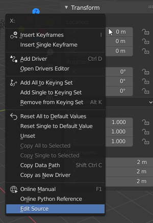
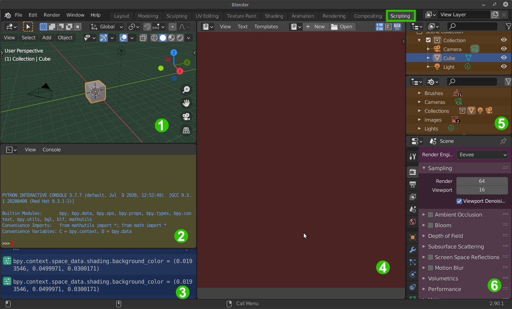
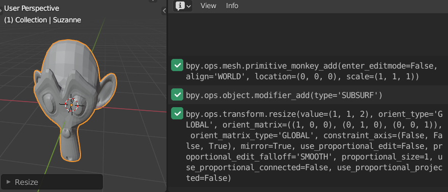
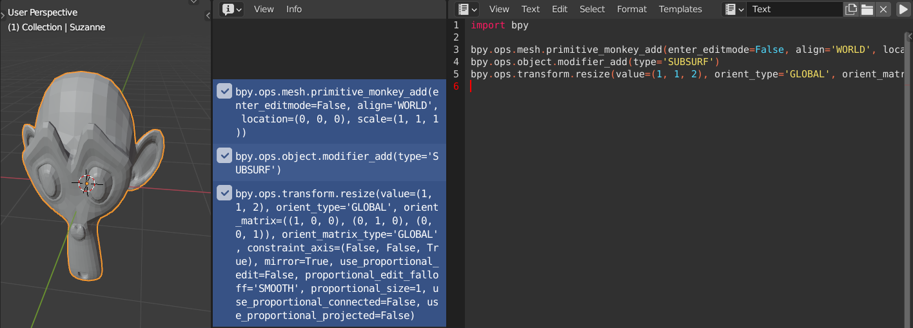

 


**In dieser Übung wollen wir uns mit dem Setup von Blender für Scripting, sowie den Tools, die uns von Blender selbst dafür zur Verfügung gestellt werden beschäftigen.**

## Blender Setup
- Ladet euch zunächst von [Blender.org](https://www.blender.org/download/) die aktuelle Version von Blender herunter. Dieses Script behandelt die Version 2.90. Zukünftige Versionen könnten eventuell Änderungen an der API vornehmen, normalerweise bleibt die API bei Updates jedoch großteils unverändert.

<!--Link zu CG Webseite? Ist ja nicht immer alles Online und vlt auch nicht immer auf Davids Webspace?-->
> Eine Einführung in Blender selbst, sowie Links mit Tutorials etc. gibt es im [**Script zur Veranstalltung Computergrafik**](https://sftp.hs-furtwangen.de/~lochmann/computergrafik2019/script/chapter01/lecture01/) 

- Öffnet Blender und in Blender die ***Preferences***

- Aktiviert hier nun im ***Interface*** Tab *Python Tooltips* und *Development Extras*

> **Python Tooltips** zeigt beim Hovern mit dem Cursor über einen Wert dessen Pfad in der Blender API an.<br>
> 
> 
> **Development Extras** Ermöglicht einige Funktionen, die uns das Scripten erleichter, wie z.b. das Anzeigen des Python-Codes von Features (`RMB` → *Edit Source*)<br>
> 

## Scripting Tools

- Wechselt nun zum Workspace-Tab ***Scripting***

 <!--TODO Bild Counter einfügen-->
- Der **<span style="color: ForestGreen">3D View</span>** <span class="counter">1</span> stellt die aktuelle Szene in 3D dar.
- Die **<span style="color: DarkGoldenRod">Python Konsole</span>** <span class="counter">2</span> ermöglicht es live Python-Befehle mit Autovervollständigung (`TAB`)auszuführen
- Das **<span style="color: Blue">Info Fenster</span>** <span class="counter">3</span> gibt den Code von in Blender ausgeführten Aktionen aus
- Im **<span style="color: Red">Text Editor</span>** <span class="counter">4</span> wird der Code für unsere Scripte geschrieben
- Die beiden **<span style="color: DarkOrange">Outliner Fenster</span>** <span class="counter">5</span> zeigen oben die aktuelle Szenen-Hierarchie und unten alle Daten des geöffneten Blender Files
- Der **<span style="color: Magenta">Properties Editor</span>** <span class="counter">6</span> ermöglicht die Bearbeitung von Werten des aktuellen Objekts, sowie Einstellungen der Szene.

## Live Scripting

<!--Zwei-Spalten layout in "Markdown" WOW! Funktioniert nur ohne Einrückung-->
<div class="row">
<div class="column left">

Die **Python Konsole** ermöglicht Live Scripting. Auch Auto Vervollständigung ist möglich. So kann beispielsweise bpy. (**b**lender **py**thon API) getippt werden und anschließend mit `TAB` die verfügbaren nachfolgenden Pfade angezeigt werden. Mit `Pfeil nach oben` kann der letzte Befehl wieder aufgerufen werden.

Mit folgendem Befehl können wir z.b. mit der folgenden Reihe an Befehlen die Position des selektierten Objekts verändern:
```n
bpy.context.object.location = (1, 0, 0)
```

Pfade können auch in Variablen gespeichert und dann über diese manipulert werden:
```n
my_cube = bpy.context.object
```
```n
my_cube.location.x += 2
```

wird lediglich der Pfad zu einer Variablen oa. eingegeben, gibt die Konsole deren Wert zurück. Z.b. ```my_cube.scale``` gibt ```Vector((1.0, 1.0, 1.0))``` zurück. Wir wissen also nun, dass es sich bei scale um eine Datenstruktur "Vector" handelt und diese die Werte (1,1,1) für x, y und z hat.

Die Struktur der API wird im folgenden Kapitel noch genauer behandelt.

</div>
<div class="column right">
<video autoplay controls loop src="img/live_console.mp4"></video>
</div>
</div>

## Abläufe als Script speichern

Das Info Fenster gibt uns für die meisten Aktionen, die wir in Blender tun den Python-Code aus, der im Hintergrund ausgeführt wird. So können wir schnell Arbeitsabläufe einfach aus dem Info Fenster herauskopieren und als Script abspeichern, um uns repetetive Arbeit zu sparen.


*Das Info Fenster nachdem ein Affenkopf hinzugefügt wurde, diesem ein Subdivisio Surface Modifier hinzugefügt wurde und er auf der Z-Achse um 2.0 skaliert wurde*

Nun kann der Inhalt des Info-Fensters mit `LMB + Drag` selektiert werden und mit `STRG + C` & `STRG + V` in das Textfenster kopiert werden (vorher dort oben auf ***New*** klicken).

Damit unser Script funktioniert muss hier noch das **bpy Modul** importiert werden (in der Echtzeit-Konsole geschieht dies automatisch).

Die meisten Optionen der Operatoren haben Standardwerte und können weggelassen werden, wenn sie nicht benötigt werden. Es reicht daher für diesen Zweck auf folgender Code:

```python
import bpy

bpy.ops.mesh.primitive_monkey_add()
bpy.ops.object.modifier_add(type='SUBSURF')
bpy.ops.transform.resize(value=(1, 1, 2)) #(1, 1, 2) steht hierbei für 1 auf X- und Y-Achse und 2 auf der Z-Achse
```

> in Python können Funktionsparameter (hier z.b. der *value* Vektor der resize Funktion) entweder in deren Reihenfolge ohne Bezeichner, oder mit Bezeichner in beliebiger Reihenfolge aufgerufen werden.



Nun kann das Script mit Klick auf den Play-Button oben im Texteditor oder mit dem Shortcut `ALT + P` (mit Mauscursor im Texteditor) ausgeführt werden.

## Affentheater
Todo

```python
import bpy

GRID_SCALE = 5
GRID_SIZE = 5

for i in range(0, GRID_SIZE):
    for j in range(0, GRID_SIZE):
        bpy.ops.mesh.primitive_monkey_add(location=(GRID_SCALE * j ,GRID_SCALE * i, 0))

        bpy.ops.transform.rotate(value=0.575267, orient_axis='Z', orient_type='VIEW', orient_matrix=((4.93038e-32, 1, 2.22045e-16), (2.22045e-16, 4.93038e-32, 1), (1, 2.22045e-16, 4.93038e-32)), orient_matrix_type='VIEW')

        bpy.ops.transform.translate(value=(0, 0, 0.608087), orient_type='GLOBAL', orient_matrix=((1, 0, 0), (0, 1, 0), (0, 0, 1)), orient_matrix_type='GLOBAL')

        # bpy.ops.object.modifier_add(type='SUBSURF')
        # bpy.context.object.modifiers["Subdivision"].levels = 1
        bpy.ops.object.shade_smooth()

```

## Aufgabe bis zum nächsten Mal
- Schreibt ein Script, welches eine Horde (5 oder mehr) von Affen in der Szene platziert und im Kreis anordnet
- Optional: Lasst die Affenköpfe alle in die Mitte der Szene gucken.
> **Tipps** 
> - Die Formel für die Position eines Punktes im Einheitskreis ist<br>
> <br>
> - **t** ist dabei der Winkel in Radianten. 360° entspricht 2Pi
> - Zur Nutzung von Sinus & Cosinus muss das math Modul importiert werden 
> ```python
>  import math
> ```

## Ressourcen & Tutorials zum Thema

| Art/Länge | Titel | Beschreibung | Quelle |
|---|---|---|---|
|  44min | [Python Crashcourse for Blender](https://youtu.be/XqX5wh4YeRw) | Guter Schnelleinstieg in Scripting mit Blender | [YouTube -  Curtis Holt](https://www.youtube.com/channel/UCzghqpGuEmk4YdVewxA79GA) |
| | [Blender Python API Dokumentation](https://docs.blender.org/api/current/info_quickstart.html) | Offizielle Blender API Dokumentation | [Blender Python API Dokumentation](https://docs.blender.org/api/current/index.html) |
| 21x je 5-20min | [Blender Python - Scripting Series](https://www.youtube.com/playlist?list=PLFtLHTf5bnym_wk4DcYIMq1DkjqB7kDb-) | Ausführlichere Serie zu Blender Scripting | [YouTube - Darkfall](https://www.youtube.com/c/DarkfallBlender) |
| 15x je 5-20min | [Scripting for Artists](https://cloud.blender.org/p/scripting-for-artists/) | Sehr gute aufgearbeitete Serie zu Blender Scripting und Addon Entwicklung - teilweise jedoch kostenpflichtig | [Blender Cloud](https://cloud.blender.org/welcome) - [Dr. Sybren A. Stüvel](https://stuvel.eu/) |
| | [Einführung ins Programmieren mit Python](https://pythonbuch.com/) | Auf Deutsch | [pythonbuch.com](pythonbuch.com) |
| | [The Python 3.7 Tutorial](https://docs.python.org/3.7/tutorial/index.html) | Einstieg in Python | [Offizielle Python 3.7 Documentation](https://docs.python.org/3.7/) |
| 111min | [Python Tutorial 2020](https://youtu.be/H1elmMBnykA) | Einführung in alle wichtigen Python Funktionalitäten (Blender unabhängig) | [YouTube - Derek Banas](https://www.youtube.com/channel/UCwRXb5dUK4cvsHbx-rGzSgw) |