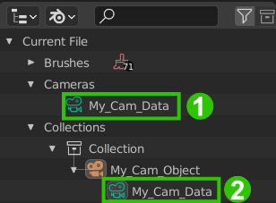

## Das Blender-Python-Modul `bpy`

Wie in anderen Programmiersprachen auch, lassen sich in Python Bibliotheken anlegen, die abrufbare Funktionalität in vordefinierten Klassen und Methoden (Funktionen) bereit halten. Diese heißen in Python _Module_. Um in Python-Skripten für Blender auf die von Blender vorgehaltene Funktionalität zugreifen zu können, steht in Blender-Python-Skripten das Modul `bpy` (Abk. f. _Blender Python_) zur Verfügung. 

In Blender-Skripten muss dieses Modul wie jedes andere Modul auch zunächst mit einer `import`-Anweisung eingebunden werden:

```Python
import bpy

# Rest des Skripts...
```

Wird die in Blender eingebaute interaktive Python-Konsole verwendet, ist dies automatisch schon geschehen, d.h. es kann direkt auf alles, was `bpy` bietet, zugegriffen werden.

### Aufteilung

Das Modul `bpy` bietet die gesamte skript-bare Blender-Funktionalität in acht "Unterebenen" an.


- Gebt auf der Blender-Python-Console nur `bpy.` ein und drückt dann `Strg`-`Leertaste`, bzw. den Button "Autocomplete" 
- Es werden die acht möglichen "Unterebenen" angezeigt.



Von diesen acht Gruppen unterhalb von `bpy` sollen hier die folgenden drei näher betrachtet werden:
- `bpy.ops`
- `bpy.context`
- `bpy.data`

## Die wichtigsten "Untermodule" von `bpy`

### `bpy.context` 

Klassen und Methoden unterhalb von `bpy.context` erlauben den Zugriff auf den aktuellen Kontext, in dem sich der Benutzer befindet wie z.B. Szene, Modus, Selektierte Objekte, Faces, Kanten u. Vertices.

---

###  `bpy.data` 

`bpy.data` ermöglicht den Zugriff auf die interne Datenstruktur der gerade in Blender geöffneten Datei. Letztendlich wird hier das ".blend"-Datenformat abgebildet. Auf alles, was in einer .blend-Datei enthalten ist, kann mit  `bpy.data` Zugegriffen werden. Einen Überblick darüber, was das ist, liefert die *Blender File* Ansicht des Outliners.
Python-Kommandos aus den Tool-Tips, die über Benutzerschnitsstellenelemente von Blender Zugriff auf Daten der Szene ermöglichen, sind meistens über `bpy.data`.

Ein typischer Anwendungsfall ist zum Beispiel der Zugriff auf Materialien. Dieser erfolgt mit 
```python
bpy.data.materials["materialname"]
```





Oft sind Daten über verschiedene Pfade abrufbar. So sind zum Beispiel die Kameradaten hier entweder über den Aufruf der Liste mit allen Kameradaten der Blender-Datei möglich 

```python
bpy.data.cameras["My_Cam_Data"]
```

**oder** über die [Collection](https://docs.blender.org/manual/en/latest/scene_layout/collections/collections.html), welche das Kameraobjekt *My_Cam_Object* und die ihm zugewiesenen Kameradaten beinhaltet 


```python
bpy.data.collections["Collection"].objects["My_Cam_Object"].data
```



<br>




Zu beachten ist hier, dass *My_Cam_Object* nicht dasselbe ist wie *My_Cam_Data*. Ersteres ist das generische Blender-Objekt - z.b. mit dessen Transformation. Letzteres sind die ihm zugewiesenen Kameradaten - z.b. mit Brennweite und Tiefenunschärfe.



---

### `bpy.ops` 

`bpy.ops` steht für **"Operatoren"**. Hierunter verbergen sich die Kommandos, die über Tastenkombinationen oder Menüeinträge eingegeben werden können. Die Kommandos, die im Arbeitsbereich des Info-Editors angezeigt werden, stammen meistens aus `bpy.ops`.

Zu beachten ist hierbei, dass mach jedem Aufruf eines Operator ein Szenenupdate gemacht wird. In Performancerelevanten Code sollten diese daher sparsam verwendet werden. So kann beispielsweise ein Objekt entweder über den Transform-Operator verschoben,

```python
bpy.ops.transform.translate(value=(1,0,0))
```

oder dessen Position im Raum direkt angesprochen werden:

```python
bpy.context.object.location.x += 1

#bzw nach import von mathutils mit 
bpy.context.object.location += mathutils.Vector((1,0,0))
```


## Beispiel: Matrix Extrude


## Aufgaben

Implemeniert ein Skript zum unten beschriebenen "Matrix Extrude":

Insbesondere beim Box Modelling kommt folgende Abfolge von Bearbeitungsschritten auf einer Fläche häufig vor

1. Fläche wird in Richtung der Flächennormalen um eine Länge extrudiert.
2. Die extrudierte Fläche wird skaliert (z.B. verkleinert).
3. Die extrudierte Fläche wird rotiert.

Durch mehrfaches Wiederholen der o.g. Schritte lassen sich sehr gut "Auswüchse" aus einem bestehenden Box-Modell erzeugen, wie z.B. Arme, Beine, Tentakel u.ä.

Schreibt ein Skript, das die aktuell selektierten Flächen eines Mesh um einen bestimmten Betrag entlang der Normalen extrudiert, die Flächen um einen bestimmten Betrag skaliert und rotiert. Packt diese drei Anweisungen in eine Schleife, die eine definierte Anzahl von durchläufen wiederholt wird.


Tipp: Führt oben genannten Arbeitsschritte von Hand aus und schaut im Arbeitsbereich des Info-Editors, welche Python-Befehle sich dahinter verbergen. Die im Info-Editor angezeigten Befehele enthalten immer den vollen Parametersatz. Davon können viele Einstellungen weggelassen werden, wenn sie sowieso die voreingestellten Standardwerte sind. Dünnt die Aufrufe in Eurem Code aus.


Packt die vom Benutzer zu verändernden Werte wie Rotationswinkel/Achse, Skalierungsfaktor, Extrusions-Strecke und Anzahl der Wiederholungen in Variablen, die zentral am Anfang des Skriptes stehen und dort bequem geändert werden können.


- Arbeitet das einleitende Kapitel der offiziellen [Blender Python Dokumentation](https://docs.blender.org/api/current/info_quickstart.html) durch.
  - Was ist das besondere an den `bpy`-Collections?
  - Wie wird ein neues Mesh erzeugt?
  - Wie setze ich das aktuell selektierte Objekt in Python?


<!-- TODO Erstzen
- Sucht im Internet sinnvolle Python-Code-Schnipsel für die Verwendung der drei oben genannten "Untermodule" `bpy.context`, `bpy.data`, `bpy.ops`.
 - Probiert die Code-Schnipsel selbst aus.
 - Variiert den Code und schaut was sich ändert
 - Lest die Referenz-Doku u. ggf. andere Quellen zu den verwendeten Befehlen nach.
 - Gibt es im jweiligen Untermodul ähnliche Befehle? Welche Funktion haben diese
-->


## Prozedurale Würfeltürmchen bauen


Türmchen:

- Genau gestapelte Würfel
- nach oben schmaler werden
- Würfel mit random Scale, Z-Rotation und Location-Offset

**Beispielcode Würfeltürmchen**
```python
import bpy
import random
from datetime import datetime

import mathutils

MAX_STACKS = 10
MIN_STACKS = 2
MAX_SCALE = 2.5
MIN_SCALE = 0.5

# clear scene - später entfernen
bpy.ops.object.select_all(action='SELECT')
bpy.ops.object.delete()


random.seed(datetime.now())

bpy.ops.mesh.primitive_cube_add()
C = bpy.context

src_obj = C.active_object

src_obj.rotation_euler.z = random.random() * 360

rand_scale = random.uniform(MIN_SCALE, MAX_SCALE)
src_obj.scale = mathutils.Vector((rand_scale,rand_scale,rand_scale))
src_obj.location.z = rand_scale

height = rand_scale * 2 # * 2 weil cube 2m groß ist. Später durch dimensions ersetzen.

previous_scale = rand_scale

for i in range (1, random.randint(MIN_STACKS, MAX_STACKS)):
    new_obj = src_obj.copy()
    new_obj.data = src_obj.data
    new_obj.rotation_euler.z = random.random() * 360
    
    rand_scale = random.uniform(MIN_SCALE, MAX_SCALE)  * (1 - i / MAX_STACKS)
    
    new_obj.scale = mathutils.Vector((rand_scale, rand_scale, rand_scale))
    
    height += rand_scale
    new_obj.location.z = height
    height += rand_scale
    
    previous_scale = rand_scale
    
    C.collection.objects.link(new_obj)

```