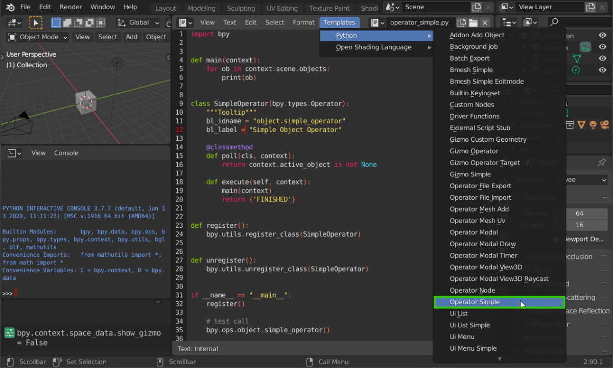

<!--
**Addon mit UI erstellen um Würfeldimension zu generieren:**

- Set an Türmchenassets generieren
- Mit Voronoi Diagram (Kollisionsfrei - oder doch Partikelsystem wenn zu kompliziert) auf Fläche verteilen
- Würfel bis zum Horizont - hübsch rendern (bei Bedarf vorgegebene Szene)
-->

Bisher sind alle Funktionalitäten, die wir mit unseren Scripten erstellt haben auch nur als solche ausführbar - als Script im Texteditor. In dieser Übung wollen wir das ändern und Blender selbst um eine Benutzeroberfläche für die Generierung unserer TODO - JA WAS DENN erweitern.

## Operatoren

Wir haben bereits die `ops` Kategorie des `bpy` Moduls kennengelernt. Nun wollen wir unseren eigenen Operator schreiben, der dann auch über die API aufgerufen und mit der `F3`-Suche gefunden werden kann.



- öffne im Text Editor das *"Operator Simple"* Template.



Sehen wir uns hier nun ersteinmal die Klasse `SimpleOperator an`
```python
class SimpleOperator(bpy.types.Operator):
    """Tooltip"""
    bl_idname = "object.simple_operator"
    bl_label = "Simple Object Operator"

    @classmethod
    def poll(cls, context):
        return context.active_object is not None

    def execute(self, context):
        main(context)
        return {'FINISHED'}
```

- Mit der Deklaration **`class SimpleOperator(bpy.types.Operator)`** geben wir an, dass unsere Klasse ein Operator ist - also von `bpy.types.Operator` erbt.
- Darunter können wir mit **`"""Mein Tooltipp"""`** eine Beschreibung angeben, die dem Nutzer beim überfahren des Operators mit dem Cursor angezeigt bekommt.
- **`bl_idname`** ist der pfad API-Pfad unter dem der Operator aufrufbar sein wird `"object.simple_operator"` lässt sich dann mit `bpy.ops.object.simple_operator()` aufrufen.
- `bl_label`
<!--Warum ist poll classmethod und execute nicht?-->
- Die **`poll`** Methode ist optional. Sie empfängt hier TODO(KLASSE) und den aktuellen Kontex

- Die **`execute`** Methode ist der tatsächlich ausgeführte Code beim aufrufen des Operators. Ihr wird hier `self` übergeben (in Python wird über `self.meine_variable` auf Membervariablen der aktuellen Klasseninstanz zugegriffen) und wiederum der aktuelle Kontext.

Der ausgeführte Code wurde hier in die `main` Methode ausgelagert. Diese könnte auch anders heißen und andere Parameter haben. In diesem Beispiel wird über jedes Objekt in der aktuellen Szene `context.scene.objects` iteriert und dieses in der Konsole ausgegeben. `for` lässt dich in Python nutzen wie `foreach` in anderen Sprachen.

Schließlich fallen noch die beiden Methoden `register` und `unregister` auf. Diese sind außerhalb des Klassenrumpfes .


Wenn viele Klassen zu registrieren sind, lässt sich auch die `register_classes_factory` nutzen, der ein Tuple an Klassen übergeben wird.

```python
register, unregister = bpy.utils.register_classes_factory(
    (MeineKlasse1,
    MeineKlasse2,
    MeineKlasse3,)
)
```


- Zu guter Letzt folgen die etwas kryptische Zeilen
```python
if __name__ == "__main__":
    register()

    # test call
    bpy.ops.object.simple_operator()
```

Die Überprüfung `if __name__ == "__main__"` überprüft dabei lediglich, ob das Script gerade über den Texteditor gestartet wird. Hier kann also Code untergebracht werden, der nicht ausgeführt wird, wenn das Script als Addon installiert wird. In diesem Fall also die registrierung des Operators in der API und ein Testlauf.


- Stelle sicher, dass **Preferences → Interface → Developer Extras** aktiviert ist (nur dann lassen sich so erstellte Operatoren mit F3 suchen)
- Führe das SKript *Operator Simple* im Texteditor aus
- Öffne die Systemkonsole mit **Window → Toggle System Console**
- Suche im mit F3 nach *"Simple Object Operator"

In der Konsole wird nun eine Liste der Objekte in der Szene ausgegeben.


found bundled python: C:\Blender\daily\blender-2.91.0-7ff6bfd1e0af-windows64\2.91\python
&lt;bpy_struct, Object() at 0x000001D2821FC088&gt;
&lt;bpy_struct, Object("Light") at 0x000001D2821FC608&gt;
&lt;bpy_struct, Object("Camera") at 0x000001D2821FBB08&gt;>}}
 

