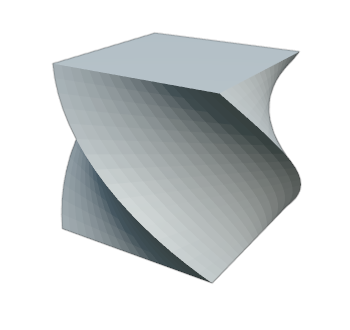

**Basics der Meshgenerierung und -manipulation**

## Vorbereitung

Aktiviere das vorinstallierte Addon **MeasureIt Tols**. Dieses erlaubt es uns, Indices, Positionen und andere Infos des selektierten Objekts im Viewport anzuzeigen.

<video src="./img/measureit.mp4" autoplay loop style="width: 80%;"></video>

Nach der Installation sind dessen Optionen in der Sidebar (Shortcut **N →  View → MeasureIt Tools → Mesh Debug**) zu finden. Das Addon selbst muss noch mit **Show** ganz oben im Panel gestartet werden.


- Vertices bewegen
- Anwendung? Funktion plotten, Terrain / Fraktal generieren?

Zu den wichtigsten Aufgaben von Addons gehört die Manipulation und generierung neuer Meshes. Hierfür bietet uns die Blender API zwei Möglichkeiten. 

- Die **mesh** Schnittstelle erlaubt uns die schnelle Manipulation von Meshes, indem es uns Zugriff auf dessen einzelne Vertices, Edges und Polygone gibt. 

- Das Modul **bmesh** ist eine weitaus komplexere Bibliothek, die bei komplexeren Mesh-Manipulationen und -Generierungen zum Einsatz kommen sollte.


## Vertices 

Die Vertices  des Meshes werden in dessen Array `vertices` gespeichert. Jeder Vertex hat eine `co` (Coordinates) Variable, die einen Vector mit x,y und z Position des Vertex repräsentiert.

```python
import bpy

currentmesh = bpy.context.object.data

for vert in currentmesh.vertices:
    vert.co.z += 1

currentmesh.update()
```

Um Normalen etc neu zu berechnen, muss das am Ende die `update` Methode des Meshes aufgerufen werden.

Alleine mit der Manipulation der Vertixpositionen kann schon viel erreicht werden. Hier wurde zum Beispiel einer UV-Sphere ein schraubenartiges Muster gegeben:




```python
import bpy
import math

frequency = 10
amplitude = 0.2

currentmesh = bpy.context.object.data

for vert in currentmesh.vertices:
    vert.co.y += amplitude * math.sin(frequency * vert.co.z)
    vert.co.x += amplitude * math.cos(frequency * vert.co.z)

currentmesh.update()
```








Schreibe ein Script, dass einen unterteilten Würfel nach oben hin um 90° verdreht (siehe Bild).



**Tipps:** 

- Die Formel für die Rotation eines zweidimensionalen Vectors um den Nullpunkt um den Winkel *w* ist folgende:<br>
*x' = x ⋅ cos(w) - y ⋅ sin(w)<br>
y' = x ⋅ sin(w) + y ⋅ cos(w)*

- Der Drehwinkel muss abhängig von der Höhe ves Vertex sein.





- Zunächst berechnen wir den Winkel in Radianten, in dem jeder Vertex gedreht wird. Dieser soll abhängig von dessen Höhe z sein. Damit wir unten am Würfel mit 0 beginnen, fügen wir z 1 hinzu (denn der Würfel ist 2 Hoch und hat seine Mitte auf Höhe 1) <br>
`angle = math.radians((vert.co.z + 1) * 45)`

- Nun rotieren wir jeden Vertex auf der Z-Achse um den Nullpunkt. Z bleibt also unverändert. Die obige Formel in Python sieht folgendermaßen aus:<br>
`x = vert.co.x * math.cos(angle) - vert.co.y * math.sin(angle)`<br>
`y = vert.co.x * math.sin(angle) + vert.co.y * math.cos(angle)`

- letztlich weisen wir die so generierten x und y Werte dem Vertex wieder zu<br>
`vert.co.x = x`<br>
`vert.co.y = y`

Der ganze Code sieht also so aus:

```python
import bpy
import math

currentmesh = bpy.context.object.data

for vert in currentmesh.vertices:
    
    angle = math.radians((vert.co.z + 1) * 45)
    
    x = vert.co.x * math.cos(angle) - vert.co.y * math.sin(angle)
    y = vert.co.x * math.sin(angle) + vert.co.y * math.cos(angle)
    
    vert.co.x = x
    vert.co.y = y

currentmesh.update()
```



## Neues Mesh

