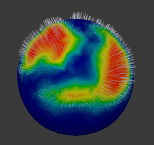
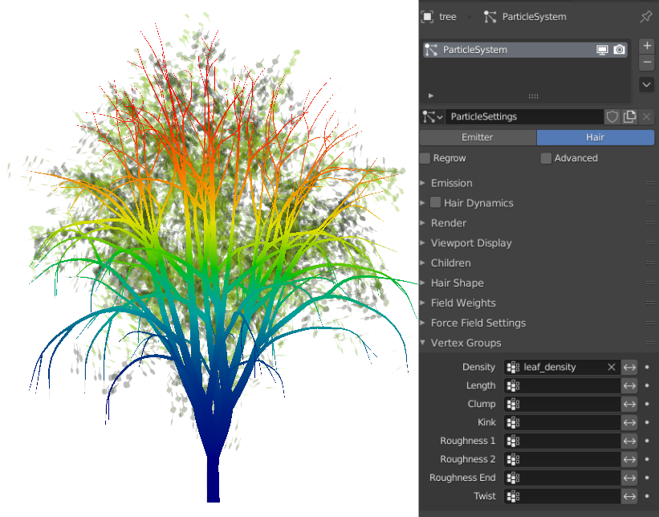

Bei der Generierung von Assets kann es auf den ersten Blick naheliegend oder wünschenswert erscheinen, alles an Meshes selbst zu generieren. Damit macht man sich allerdings mehr Aufwand als nötig und hat zudem wahrscheinlich schlechter Performance und Nutzerfreudlichkeit, als wenn man einfach mit den bereits vorhandenen Werkzeugen arbeiten würde. Für uns als Addonentwickler ist es daher wichtig, die Möglichkeiten Software mit der wir arbeiten gut zu kennen. Wichtig sind bei der Assetgenerierung vor allem die Modifier.

Ein einfaches Beispiel: Wir wollen einen Baum mit Blättern generieren.




- Der naive Ansatz wäre nun, das Mesh des Stams komplett selbst zu generieren - dabei komplizierte Algorithmen anzuwenden, um die Generierung des Meshes umzusetzen
- Der klügere Ansatz hier wäre nur das Skelett des Baumes mit Edges nachzuzeichnen. Den Rest kann nämlich ein *Skin Modifier* , der Geometrie um unser Edge-Selett herum erzeugt und ein *Subdivision Surface Modifier*  für uns erledigen.









Das Hinzufügen von Modifiern ist in Python sehr einfach. 

```python
mod_skin = my_object.modifier_add("my_skin_modifier" type='SKIN')
```

- Die Parameter unterscheiden sich natürlich je nach Modifier und können entweder über deren Python-Tooltips (im Blender UI bei Maus-hover) oder in der Dokumentation  recherchiert werden. 


- Besonders wichtix ist der *vertex-group* Parameter, den viele Modifier haben. Vertex-Groups  bestimmen, wie stark sich der Modifier auf jede Stellen des Meshes auswirkt.

- Vertex Groups  sind auch für andere Bereiche von Blender wichtig, zum Beispiel für die Verteilung von Partikeln und den Einfluss von Knochen auf das Mesh beim Rigging. Vertex Groups können in der UI im Weight-Paint Modus gezeichnet werden.

<br>*Vertex Group im Weight Paint Modus. Jeder Vertex hat einen Wert von 0-1 (blau-Rot) und je nach dessen Stärke verteilen sich in diesem Beispiel die Partikel auf dem Mesh.*

Im Beispiel unseres Baumes können wir eine Vertex Group nutzen, um den Einfluss eines *Displacement Modifiers* zu kontrollieren, der Windanimation simulieren soll. Desto weiter unten im Baum, desto schwächer soll der Einfluss des Modifier sein. Daher steigen die Einflusswerte der Vertex Group nach oben im Baum immer weiter an.

<video src="img/displacement.mp4" autoplay loop></video>

Das gleiche Prinzip - vorhandene Funktionalitäten zu verwenden anstatt von Grund auf aufzubauen lässt sich auf viele Gebiete Anwenden. So kann zum Beispiel auch die Verteilung der Blätter auch im Skript über ein Partikelsystem umgesetzt werden. 

<br>
*Die Blätter werden über ein Partikelsystem anhand des Wertes einer Vertex Group über den Baum verteilt.*



Die Anforderungen für das Skripting-Projekt betrifft das insofern, dass Ressourcen gespart werden wo es geht, die dann in erweiterte Funktionalität und User Experience reinvestiert werden sollten.

- Schafft euch einen groben Überblick darüber, welche Modifier für euer Projekt interessant sein könnten

- Überlegt euch, welche anderen Abläufe sich eventuell mit existierenden Funktionalitäten umsetzen lassen

- Wie kann euer Addon / Skript dem Nutzer helfen, diese Abläufe zu automatisieren und welche weiteren Werkzeuge stellt ihr ihm zusätzlich zur Verfügung

