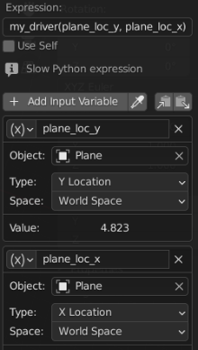

Zur Generierung von Animationen stellt uns die Blender API verschiedene Möglichkeiten zur Verfügung. In folgender Übung werden wir uns die wichtigsten hiervon ansehen.

- Keyframes
- Driver
    - Scripted Expressions
    - Custom Drivers
- App Handlers

## Driver

Driver geben uns die Möglichkeit, Abhängigkeiten von Variablen verschiedener Objekte definieren. Fast jeder Variable in Blender kann mit `RMB` → *Add Driver* ein Driver hinzugefügt werden. Im Nun erscheinenden Fenster können dem Driver Input-Variablen anderer Objekte hinzugefügt werden, die dann in einer Expression verwendet werden können, die den Wert bestimmt, den unsere Variable erhalten soll. 


In diesem Beispiel verwenden wir für die Y-Location unseres Würfels die Z-Rotation des Kurbel-Objekts und nennen sie `kurbel_rot_z` . In der Expression multiplizieren wir deren Wert dann mit 0.5 . Nun können wir durch Rotation der Kurbel unseren Würfel kontrollieren.

<video autoplay loop src="img/kurbel.mp4"></video>

### Kurven

Zudem kann der *Driver Editor* geöffnet werden (Rechtsklick auf Variable). Hier kann zusätzlich die Kurve angepasst werden, anhand der unser Driver die Variablen miteinander verknüpft. Das Ergebnis der Expression wird hierbei mit dem Wert der Kurve am jeweiligen Punkt multipliziert. 


In diesem Beispiel bedeutet das, dass der Würfel sich bis einer Rotation von 1 * 0.5 Radianten der Kurbel zum Punkt 1.0 auf der Y-Achse bewegt und sich dann wieder zurück auf 0 bewegt.


<video autoplay loop src="img/bezier.mp4"></video>



TODO


### Custom Drivers

Um nun den Bogen zum Scripting zu schlagen, können wir auch Python-Funktionen als Driver definieren. Ein sehr einfaches Beispiel sieht folgendermaßen aus:

```python
import bpy

def my_driver(val, v2):
   """Returns the square of the given value"""
   return v2 * v2

bpy.app.driver_namespace['my_driver'] = my_driver
```

Zunächst definieren wir eine Funktion, welche beliebig viele Variablen entgegennimmt und einen Wert ausgibt. Dann fügen wir unsere Funktion dem `driver_namespace` hinzu. Nach Ausführung des Scripts können wir nun die Funktion `my_driver` in der Expression eines Drivers verwenden.




Custom Drivers sind zwar mächtig, sollten jedoch eher sparsam eingesetzt werden. Da in einer Animation die Funktion jeden Frame ausgeführt werden muss und Python recht langsam ist, kann die Performance hier schnell einbrechen.



TODO

