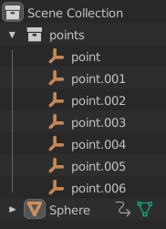

Zur Generierung von Animationen stellt uns die Blender API verschiedene Möglichkeiten zur Verfügung. In folgender Übung werden wir uns die wichtigsten hiervon ansehen.

- Keyframes
- Driver
    - Scripted Expressions
    - Custom Drivers
- App Handlers

## Keyframes

Wir können die Blender API nutzen um per Script Keyframes zu setzen. Dafür wird die Methode `keyframe_insert`  verwendet. Diese kann zum Beispiel von Objekten aus aufgerufen werden. Deren wichtigste Parameter sind `data_path` (Pfad zum Wert, der verwendet werden soll) und `frame` (Framenummer des Keyframes).

Hier setzen wir beispielsweise auf unserem Würfel zunächst einen Location-Keyframe an Frame 0, verschieben den Würfel dann nach (0, 5, 0) und setzen dann einen Keyframe bei Frame 20.



```
import bpy

cube = bpy.data.objects['Cube']

cube.keyframe_insert(data_path="location", frame=1)

cube.location = (0, 5, 0)

cube.keyframe_insert(data_path="location", frame=20)
```


<video autoplay loop width=350 src="img/keyframes.mp4"></video>





Schreibt ein Script, welches eine Kugel alle Objekte innerhalb einer Collection *points* abfliegen lässt. Es soll so aussehen, als spränge die Kugel von Punkt zu Punkt. 



<video autoplay loop src="img/pointjumper.mp4"></video>




**Lösung**

Um zu beginnen suchen wir unsere benötigten Objekte und legen fest, wie lange die Kugel für die Strecke zwischen zwei Punkten brauchen soll:

```python
import bpy

points = bpy.data.collections['points'].objects
sphere = bpy.data.objects['Sphere']

FRAMES_PER_POINT = 20
```

Nun iterieren wir über alle Objekte in `points` und setzen jeweils die Kugel an die Position des aktuellen Objekts. Dann setzen wir einen Keyframe an die Stelle `FRAMES_PER_POINT * i`

```python
for i in range(0, len(points)):
    sphere.location = points[i].location
    sphere.keyframe_insert(data_path="location", frame=FRAMES_PER_POINT * i)
```

...

- So fliegt der Ball nun schon zwischen den Punkten umher. Als nächstes soll er mit konstanter Geschwindgkeit fliegen - also muss der zeitliche Abstand des Keyframes an jedem Punkt jeweils abhängig von der Distanz zum letzten Punkt sein. Zuerst nutzen wir den Satz des Pythagoras, um die die Distanz zwischen zwei Punkten zu errechnen

```python
def get_distance(p1, p2):
    return math.sqrt((p1[0] - p2[0]) ** 2 + (p1[1] - p2[1]) ** 2 + (p1[2] - p2[2]) ** 2)
```

- Innerhal der Punkte-Schleife berechnen wir dann jeweils die Distanz zum vorherigen Punkt. 
- Um uns eine If-Abfrage zu sparen, lagern wir den Keyframe für den ersten Punkt (der keinen vorherigen Punkt hat) aus. 
- Zudem brauchen wir noch eine Variable `current_frame`, an dessen Stelle der Keyframe gesetzt wird
- `FRAMES_PER_POINT` haben wir umbenannt in `FRAMES_PER_UNIT`, da diese nun mit der Distanz multipliziert wird, um `current_frame` zu berechnen 

```python
sphere.location = points[0].location
sphere.keyframe_insert(data_path="location", frame=1)

current_frame = 1

for i in range(1, len(points)):

    sphere.location = points[i].location
    
    distance_to_last_point = get_distance(points[i].location, points[i-1].location)
    current_frame += distance_to_last_point * FRAMES_PER_UNIT

    sphere.keyframe_insert(data_path="location", frame=current_frame)
        
```

- Nun wollen wir, dass der Ball Bögen zwischen den Punkten fliegt. Dazu müssen wir zwischen aufeinanderfolgenden Punkten den Punkt in deren Mitte berechnen und nach oben verschieben.
- Wie weit der Punkt nach oben versetzt wird, soll ebenfalls von der Distanz zum letzten Punkt und einer Variable `JUMP_HEIGHT` abhängen.

```python
intermediate_point = (points[i-1].location + points[i].location) / 2
intermediate_point.z += distance_to_last_point * JUMP_HEIGHT
```


*final script*

```python
import bpy
import math
import mathutils

SPEED = 1.5
JUMP_HEIGHT = 0.7

points = bpy.data.collections['points'].objects
sphere = bpy.data.objects['Sphere']

at_frame = 1
 
def get_distance(p1, p2):
    return math.sqrt((p1[0] - p2[0]) ** 2 + (p1[1] - p2[1]) ** 2 + (p1[2] - p2[2]) ** 2)

def set_handle_types():
    for c_fcurve in sphere.animation_data.action.fcurves:
        for i, c_keyframe in enumerate(c_fcurve.keyframe_points):
            if i % 2 == 0:
                c_keyframe.handle_left_type = "VECTOR"
                c_keyframe.handle_right_type = "VECTOR"
        c_fcurve.update()

# Initial Keyframe
sphere.location = points[0].location
sphere.keyframe_insert(data_path="location", frame=1)

for i in range(1, len(points)):
    
    distance_to_next_point = get_distance(points[i-1].location, points[i].location)

    keyframe_loc = at_frame + distance_to_next_point * SPEED
    at_frame = keyframe_loc
    
    sphere.location = points[i].location
    sphere.keyframe_insert(data_path="location", frame=keyframe_loc)
    
    # Mittelpunkt zwischen 1-1 und 1 berechnen
    intermediate_point = (points[i-1].location + points[i].location) / 2
    intermediate_point.z += distance_to_next_point * JUMP_HEIGHT
    sphere.location = intermediate_point

    intermediate_keyframe_loc = at_frame - distance_to_next_point / 2 * SPEED  
    sphere.keyframe_insert(data_path="location", frame=intermediate_keyframe_loc)
    
    set_handle_types()
```





## Driver

Driver geben uns die Möglichkeit, Abhängigkeiten von Variablen verschiedener Objekte definieren. Fast jeder Variable in Blender kann mit `RMB` → *Add Driver* ein Driver hinzugefügt werden. Im Nun erscheinenden Fenster können dem Driver Input-Variablen anderer Objekte hinzugefügt werden, die dann in einer Expression verwendet werden können, die den Wert bestimmt, den unsere Variable erhalten soll. 


In diesem Beispiel verwenden wir für die Y-Location unseres Würfels die Z-Rotation des Kurbel-Objekts und nennen sie `kurbel_rot_z` . In der Expression multiplizieren wir deren Wert dann mit 0.5 . Nun können wir durch Rotation der Kurbel unseren Würfel kontrollieren.

<video autoplay loop src="img/kurbel.mp4"></video>

### Kurven

Zudem kann der *Driver Editor* geöffnet werden (Rechtsklick auf Variable). Hier kann zusätzlich die Kurve angepasst werden, anhand der unser Driver die Variablen miteinander verknüpft. Das Ergebnis der Expression wird hierbei mit dem Wert der Kurve am jeweiligen Punkt multipliziert. 


In diesem Beispiel bedeutet das, dass der Würfel sich bis einer Rotation von 1 * 0.5 Radianten der Kurbel zum Punkt 1.0 auf der Y-Achse bewegt und sich dann wieder zurück auf 0 bewegt.


<video autoplay loop src="img/bezier.mp4"></video>



TODO


### Custom Drivers

Um nun den Bogen zum Scripting zu schlagen, können wir auch Python-Funktionen als Driver definieren. Ein sehr einfaches Beispiel sieht folgendermaßen aus:

```python
import bpy

def my_driver(val, v2):
   """Returns the square of the given value"""
   return v2 * v2

bpy.app.driver_namespace['my_driver'] = my_driver
```

Zunächst definieren wir eine Funktion, welche beliebig viele Variablen entgegennimmt und einen Wert ausgibt. Dann fügen wir unsere Funktion dem `driver_namespace` hinzu. Nach Ausführung des Scripts können wir nun die Funktion `my_driver` in der Expression eines Drivers verwenden.


 
Custom Drivers sind zwar mächtig, sollten jedoch eher sparsam eingesetzt werden. Da in einer Animation die Funktion jeden Frame ausgeführt werden muss und Python recht langsam ist, kann die Performance hier schnell einbrechen.



TODO

